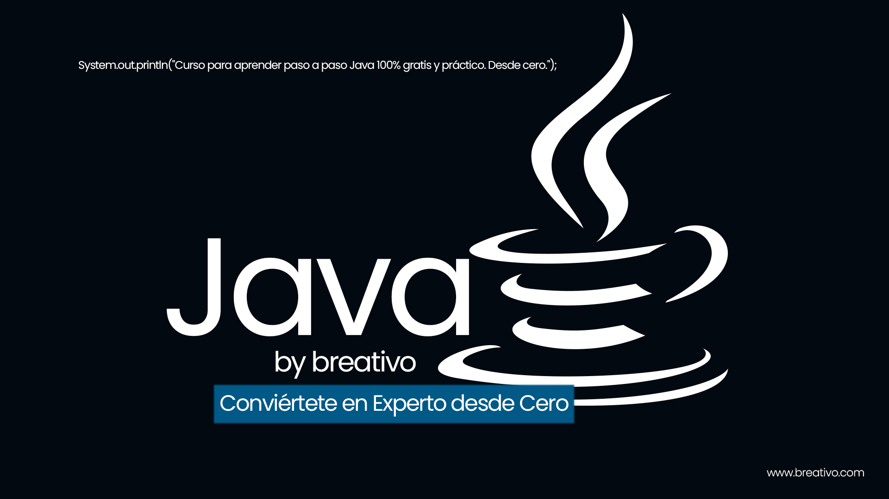

# JAVA BY BEATIVO

## Curso completo para aprender a trabjar con Java desde cero y para principiantes.

Bienvenidos al Curso de Java desde Cero: un curso gratuito y completo, diseñado para que cualquier persona, independientemente de su nivel, aprenda Java de manera sólida y práctica.

En este curso, comenzaremos desde lo más básico, abarcando los fundamentos esenciales de Java, y avanzaremos hasta temas más complejos como programación orientada a objetos (POO), concurrencia, acceso a bases de datos, y el uso del popular framework Spring Boot. Este recorrido paso a paso te brindará no solo los conocimientos fundamentales de Java, sino también herramientas avanzadas y frameworks que se usan en la industria, ¡para que puedas desarrollar aplicaciones completas y robustas!

Al finalizar el curso estarás preparado para trabajar en proyectos reales con Java, comprenderás los principios del desarrollo orientado a objetos y habrás desarrollado experiencia práctica en el uso de frameworks populares como Spring Boot.

 

## Lo que aprenderás

#### Listado de lecciones
| Número | Lección           | Código | Video  |
|--------|-------------------|-------------|--------|
| 00    | Introducción a Java    |[Código](./src/Holamundo.java)|    |
| 01    | Variables en Java | [Codigo]()   |   |
 

#### Listado de ejercicios
| Número | Ejercicio           | Código | Video  |
|--------|-------------------|-------------|--------|
## Enlaces de interes

- [DESCARGA JAVA.](https://www.java.com/es/)
- [ALTERNATIVA DESCARGAR JAVA.](https://acortar.link/Vz7BYF)
- [DESCARGAR INTELLIJ IDE](https://acortar.link/rBIaAe) Ide que estamos usando en el curso.
- [MongoDB](https://acortar.link/ZNzbHs) Base de datos usada durante el curso.
- [MySQL](https://acortar.link/BJJYxk) Base de datos usada durante el curso.
- [DOCUMENTACIÓN OFICIAL JAVA]()

 

##  Hola, Soy Mario Bello (breativo)

Hola👋 mi nombre es Mario Bello con más de 5 años de experiencia en el desarrollo y diseño de soluciones digitales, me especializo en:

- Desarrollo Full Stack: Creación de aplicaciones web completas, desde frontend hasta backend, con integración y gestión de bases de datos.

- Desarrollo de Aplicaciones Móviles: Experiencia en iOS y Android utilizando lenguajes como Java, Kotlin y Python.

- Diseño y Branding de Marcas Personales: Desarrollo integral de identidades visuales, desde la conceptualización hasta la implementación.

- Diseño y Desarrollo Interactivo: Creación de experiencias digitales dinámicas y atractivas.

Mi enfoque combina habilidades técnicas con un fuerte sentido del diseño, aportando soluciones innovadoras y personalizadas.

 

### Otras bombitas by breativo

## ¡Apóyame! 
#### Puedes apoyar mi trabajo haciendo "☆ Star" en el repositorio. ¡Gracias!

### En mi perfil de GitHub tienes más información

